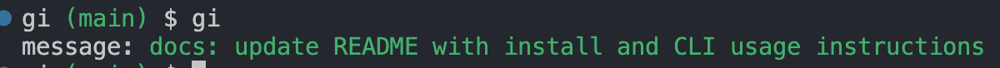

# gi

> This readme is automatically generated by [create-ink-app](https://github.com/vadimdemedes/create-ink-app)

## Install and Usage

Right now it needs to be built and run locally. I plan to release it on npm soon.

```bash
pnpm install
```

Then build and run locally:

```bash
pnpm build
```

```bash
# replace with the full path to dist/cli.js
node dist/cli.js
```

For now i'd recomend adding it as a bash alias:

```bash
alias gi="node dist/cli.js -c" # commit changes with AI-generated message
alias gid="node dist/cli.js -c -d" # dry run,shows what would be committed without making changes
```

example usage:

Here's a screenshot of the CLI in action:



## CLI

```
$ gi -c

  Usage
    $ gi [options]

  Options
    -c, --commit    Add and commit changes with AI-generated message
    -d, --dry-run   Show what would be committed without making changes

  Examples
    $ gi -c
    # Adds and commits changes with AI-generated message
    
    $ gi -c -d
    # Shows what would be committed without making changes
```
